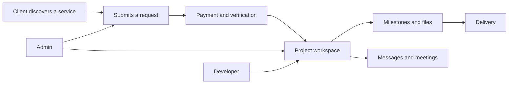

<div align="center">
  

# SkyWorld

**A production-ready workspace for digital service delivery.**

Clients discover services, submit requests, make payments, and track delivery in one place. Teams manage projects, milestones, files, messages, meetings, and operational analytics from role-based dashboards.

  <p>
    <a href="https://github.com/aakashdeepyadav/SkyWorld-SaaS-Platform"></a>
    <a href="./docs/SECURITY.md"></a>
    <a href="./server/__tests__"></a>
    
  </p>
</div>

## Overview

SkyWorld is a full-stack SaaS platform for a digital studio. It provides a complete workflow from service discovery to project delivery, with separate experiences for clients, developers, and administrators.

### What it includes

- Service catalog for web, app, branding, maintenance, and add-on work
- Structured and custom service requests
- Project workspaces with milestones, progress, assignment, files, and messaging
- Razorpay payment verification and invoice generation
- Google OAuth sign-in and optional Google Calendar / Google Meet integration
- Email OTP verification, password reset, notifications, and document delivery
- Admin analytics, audit logging, user management, and service management
- Security controls including HTTP-only JWT cookies, CSRF protection, rate limiting, Helmet, input validation, and MongoDB query sanitization

## Product Flow



## Technology

| Area           | Tools                                                     |
| -------------- | --------------------------------------------------------- |
| Frontend       | React 18, Vite 5, React Router, Tailwind CSS, React Query |
| Backend        | Node.js, Express, Mongoose, Socket.IO                     |
| Database       | MongoDB Atlas or MongoDB 7 via Docker                     |
| Authentication | JWT HTTP-only cookies, Google OAuth, OTP, optional 2FA    |
| Payments       | Razorpay                                                  |
| Storage        | Cloudinary                                                |
| Email          | Brevo SMTP, Nodemailer, Resend, MailerSend                |
| Deployment     | Vercel frontend, Render backend, Docker alternative       |
| Testing        | Vitest and Supertest                                      |

## Repository Layout

```text
client/                 React SPA and Vite build
server/                 Express API, services, models, and tests
docs/                   Architecture, API, security, deployment, and user docs
Dockerfile              Full-stack production container
docker-compose.yml      Local MongoDB, Redis, and server stack
render.yaml             Render backend service definition
```

## Quick Start

### Requirements

- Node.js 18 or newer
- npm
- MongoDB Atlas, or Docker Desktop for the local database stack

### Install

```bash
git clone https://github.com/aakashdeepyadav/SkyWorld-SaaS-Platform.git
cd SkyWorld-SaaS-Platform
npm run install-all
```

### Configure

Create local environment files from the templates:

```bash
cp server/.env.example server/.env
cp client/.env.example client/.env
```

At minimum, configure these values for local development:

```env
# server/.env
NODE_ENV=development
PORT=5000
MONGODB_URI=mongodb://localhost:27017/skyworld
JWT_ACCESS_SECRET=replace-with-a-long-random-value
JWT_REFRESH_SECRET=replace-with-a-different-long-random-value
FRONTEND_URL=http://localhost:5173

# client/.env
VITE_API_URL=http://localhost:5000/api
```

Google OAuth, Razorpay, Cloudinary, and email integrations are optional for basic startup but required for their respective workflows. See the complete variable list in [server/.env.example](./server/.env.example) and [client/.env.example](./client/.env.example).

### Run

```bash
npm run dev
```

The frontend runs at `http://localhost:5173` and the API runs at `http://localhost:5000`.

## Scripts

| Command                           | Purpose                                       |
| --------------------------------- | --------------------------------------------- |
| `npm run dev`                     | Start frontend and backend together           |
| `npm run client`                  | Start the Vite development server             |
| `npm run server`                  | Start the API with Nodemon                    |
| `npm run build`                   | Generate SEO assets and build the frontend    |
| `npm run install-all`             | Install root, server, and client dependencies |
| `npm start`                       | Start the production API                      |
| `cd server && npm test`           | Run backend tests once                        |
| `cd server && npm run test:watch` | Run backend tests in watch mode               |

## Production Deployment

The recommended deployment is **Vercel for the client** and **Render for the API**.

### Frontend on Vercel

1. Import the repository into Vercel.
2. Set the project root directory to `client`.
3. Use build command `npm run build` and output directory `dist`.
4. Configure `VITE_API_URL`, `VITE_GOOGLE_CLIENT_ID`, and `VITE_GOOGLE_REDIRECT_URI` in the Vercel project settings.
5. Deploy from the production branch.

The SPA rewrites and API proxy are defined in [client/vercel.json](./client/vercel.json).

### Backend on Render

1. Create a Render Web Service connected to the repository.
2. Set the root directory to `server`.
3. Use `npm install` as the build command and `node index.js` as the start command.
4. Add the production secrets and service credentials from [server/.env.example](./server/.env.example).
5. Set `FRONTEND_URL` to the exact HTTPS frontend origin.

The service definition is available in [render.yaml](./render.yaml). Never commit production secrets or place `GOOGLE_CLIENT_SECRET` in frontend variables.

### Google OAuth checklist

Use the exact same callback URL in Google Cloud Console, the client environment, and the server environment:

```text
https://your-domain.com/auth/google/callback
```

Also register the production frontend origin as an authorized JavaScript origin. Details are in [docs/DEPLOYMENT.md](./docs/DEPLOYMENT.md).

### Docker

Build and run the full-stack production image:

```bash
docker build -t skyworld .
docker run --env-file .env -p 5000:5000 skyworld
```

For local MongoDB and Redis services:

```bash
docker compose up --build
```

## Security

Security decisions and operational guidance are documented in [docs/SECURITY.md](./docs/SECURITY.md). Before production launch, verify HTTPS, CORS origins, JWT secrets, database access, payment webhooks, email credentials, upload limits, and monitoring configuration.

## Documentation

| Guide                                  | Description                                 |
| -------------------------------------- | ------------------------------------------- |
| [Architecture](./docs/ARCHITECTURE.md) | System boundaries and major components      |
| [API reference](./docs/API.md)         | API routes and request contracts            |
| [Database](./docs/DATABASE.md)         | Models, relationships, and indexes          |
| [Deployment](./docs/DEPLOYMENT.md)     | Hosting and production setup                |
| [Security](./docs/SECURITY.md)         | Security controls and operational checklist |
| [RBAC flow](./docs/RBAC_FLOW.md)       | Client, developer, and admin permissions    |
| [UI/UX design](./docs/UI_UX_DESIGN.md) | Interface direction and design decisions    |
| [User manual](./docs/USER_MANUAL.md)   | End-user workflows                          |
| [SRS](./docs/SRS.md)                   | Product requirements                        |

## Contributing

1. Create a feature branch from `develop`.
2. Make a focused change and add or update tests where behavior changes.
3. Run `npm run build` and `cd server && npm test` before opening a pull request.
4. Open a pull request with a short description, screenshots for UI changes, and deployment notes when relevant.

## License

This project is released under the MIT License.
